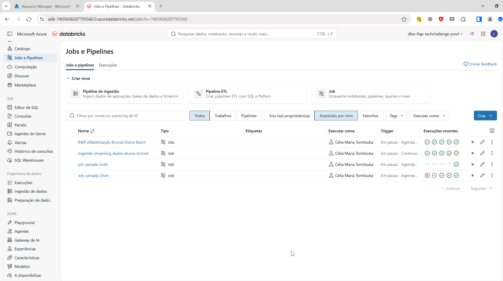
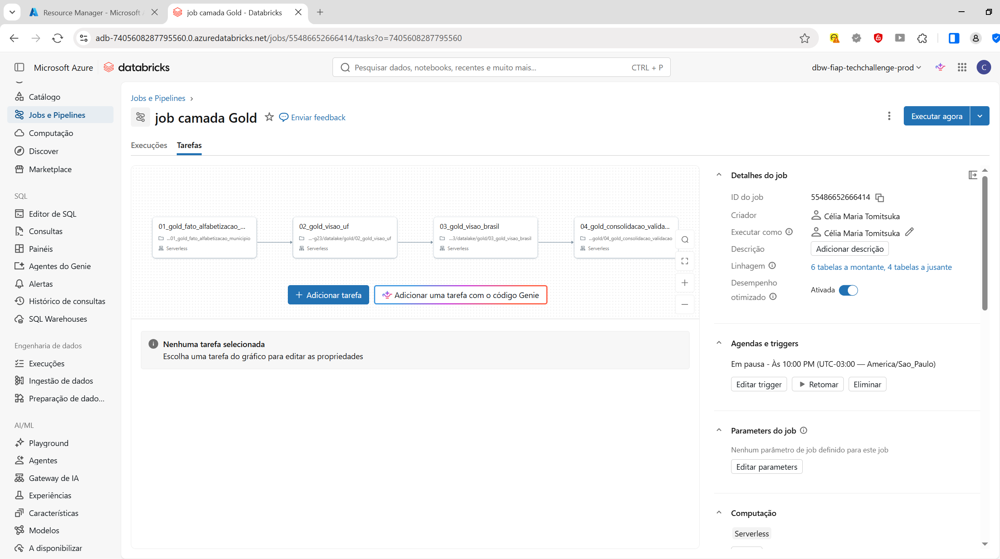
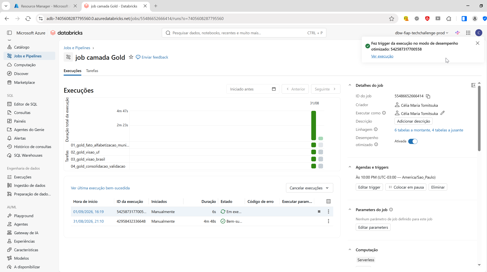

## Postech Tech Challenge | Fase 2: 

**Integrantes do Grupo (2IAST 23):**

✅ Célia Maria Tomitsuka - RM374490

✅ Nelson da Silva Paz - RM374983

✅ Nelson Toshikazu Yamamoto - RM374494

---

### 1 -  Contexto

A alfabetização infantil é um dos principais indicadores de desenvolvimento educacional do país. O programa Compromisso Nacional Criança Alfabetizada estabelece metas para que todas as crianças brasileiras estejam alfabetizadas até o final do 2º ano do Ensino Fundamental até 2030.

Este projeto integra dados do INEP, IBGE e metas educacionais para monitorar a evolução dos indicadores de alfabetização nos municípios brasileiros, fornecendo uma base confiável para análises, tomada de decisão e formulação de políticas públicas.

---

### 2 - Arquitetura


---

### 3 - Tecnologias Utilizadas

| Tecnologia | Finalidade |
|------------|------------|
| Azure Data Factory | Orquestração dos pipelines de ingestão |
| Azure Data Lake Storage Gen2 | Armazenamento das camadas Bronze, Silver e Gold |
| Azure Databricks | Processamento distribuído dos dados |
| Delta Lake | Armazenamento transacional e otimização analítica |
| Azure Event Hub | Simulação de ingestão streaming |
| Azure Key Vault | Gerenciamento |
| Azure Log Analytics | Monitoramento e observabilidade |
| Azure Bicep | Infraestrutura como código |
| Google BigQuery | Fonte dos dados do INEP |
| IBGE API | Dados territoriais |

---

### 4 - Decisões Arquiteturais

#### Batch x Streaming

A ingestão batch foi utilizada para dados históricos do INEP e IBGE, enquanto o streaming foi adotado para simular atualizações contínuas de indicadores educacionais.

#### Data Lake x Data Warehouse

A escolha do Data Lake permitiu armazenar dados brutos e processados com maior flexibilidade e menor custo operacional.

### Custo x Performance

A utilização de Delta Lake, particionamento e ZORDER permitiu equilibrar desempenho analítico e consumo de recursos computacionais.

---

### 5 - Aplicações em Inteligência Artificial

A camada Gold foi estruturada para servir como base para futuras aplicações de IA e Ciência de Dados, tais como:

- Predição da taxa de alfabetização por município.
- Identificação de municípios com maior risco de não atingir metas.
- Clusterização de municípios por perfil educacional.
- Modelagem de desigualdades regionais.
- Forecast da evolução dos indicadores até 2030.
- Apoio à formulação de políticas públicas baseadas em dados.

---

### 6 - Como Executar

---
3.1 - Clonar repositório

```
git clone https://github.com/FIAPCientistasDados/postech-aisc-fase-2-pipeline-azure-g23
```

3.2 - Acessar a pasta do projeto e instalar as bibliotecas

```
cd postech-aisc-fase-2-pipeline-azure-g23
```

```
python -m venv venv
```

```
venv\Scripts\activate
```

```
pip install -r requirements.txt
```

3.3 - Configure o .env com suas credenciais Azure (use .env.Example como base) e rode a pipeline com **make deploy**

---

## Alfabetização Brasil — Pipeline de Dados
### 7 - Camada Bronze

A camada **Bronze** foi responsável pela ingestão e armazenamento dos dados brutos provenientes das fontes externas, preservando sua estrutura original para garantir rastreabilidade e reprocessamento quando necessário.

Nesta etapa foram carregadas três fontes principais de dados:

| Notebook | Descrição |
|-----------|------------|
| `bronze_inep_alfabetizacao.ipynb` | Realiza a extração dos dados de alfabetização disponibilizados pelo INEP através do Google BigQuery. A autenticação é realizada utilizando credenciais de serviço do Google Cloud, permitindo a consulta e exportação dos dados para o Data Lake na camada Bronze. |
| `bronze_ibge_estados.ipynb` | Responsável pela ingestão dos dados cadastrais dos estados brasileiros disponibilizados pelo IBGE, utilizados como referência geográfica para integração e enriquecimento dos dados analíticos. |
| `bronze_ibge_municipios.ipynb` | Responsável pela ingestão dos dados cadastrais dos municípios brasileiros disponibilizados pelo IBGE, compondo a base de referência territorial da solução. |
| `streaming/producer.ipynb` | Simula a geração de eventos em tempo real no formato JSON, representando atualizações de indicadores educacionais. Os eventos são utilizados para demonstrar o processamento contínuo de dados em uma arquitetura híbrida (Batch + Streaming). |
| `streaming/config.ipynb` | Centraliza as configurações compartilhadas do pipeline de streaming, incluindo parâmetros de conexão, armazenamento e execução. |
| `streaming/functions.ipynb` | Contém funções utilitárias utilizadas pelos componentes de streaming para leitura, transformação e gravação dos eventos processados. |

Para a base de alfabetização do **INEP**, os dados foram obtidos diretamente do **Google BigQuery**, utilizando uma **Service Account** do Google Cloud para autenticação. Após a conexão com o BigQuery, os conjuntos de dados foram extraídos e armazenados no Data Lake sem transformações, mantendo a integridade dos dados originais para as etapas subsequentes de tratamento e enriquecimento nas camadas **Silver** e **Gold**.

Os dados do **IBGE** foram ingeridos como tabelas de referência geográfica, servindo de base para a normalização e enriquecimento das informações de estados e municípios ao longo do pipeline analítico.

Além da ingestão batch dos dados históricos do INEP e IBGE, a solução simula eventos em streaming por meio de arquivos JSON processados por pipelines do Azure Databricks.

---

### 8 - Camada Silver

A camada **Silver** é responsável pela limpeza, padronização, integração e enriquecimento dos dados provenientes da camada Bronze. Nesta etapa, os dados brutos são transformados em conjuntos consistentes e confiáveis, preparados para consumo analítico na camada Gold.

As principais atividades realizadas nessa camada incluem:

- Tratamento de valores nulos e inconsistências.
- Padronização de tipos de dados e nomenclaturas.
- Normalização das chaves de identificação de estados e municípios.
- Integração entre os dados do INEP, IBGE e metas de alfabetização.
- Criação de dimensões geográficas para enriquecimento das análises.
- Validação de regras de qualidade e integridade dos dados.

#### Notebooks da Camada Silver

| Notebook | Descrição |
|-----------|------------|
| `01_silver_indicador_municipio.ipynb` | Consolida e padroniza os indicadores de alfabetização por município. |
| `02_silver_indicador_uf.ipynb` | Gera indicadores agregados por unidade federativa. |
| `03_silver_meta_brasil.ipynb` | Processa e consolida as metas nacionais de alfabetização. |
| `04_silver_meta_uf.ipynb` | Processa e consolida as metas estaduais de alfabetização. |
| `05_silver_meta_municipio.ipynb` | Processa e padroniza as metas municipais de alfabetização. |
| `06_silver_alunos.ipynb` | Realiza o tratamento e a preparação dos dados de alunos. |
| `07_silver_dim_ibge_estados.ipynb` | Cria a dimensão de estados a partir dos dados do IBGE. |
| `08_silver_dim_ibge_municipios.ipynb` | Cria a dimensão de municípios a partir dos dados do IBGE. |

#### Dados Gerados

A camada Silver disponibiliza os principais conjuntos de dados utilizados pela camada Gold:

- `silver.indicador_municipio`
- `silver.indicador_uf`
- `silver.meta_brasil`
- `silver.meta_uf`
- `silver.meta_municipio`
- `silver.dim_ibge_estados`
- `silver.dim_ibge_municipios`

Esses conjuntos representam uma visão confiável e padronizada das informações educacionais e territoriais, servindo como base para a construção dos indicadores analíticos e dashboards da solução.

---

### 9 - Camada Gold

#### Validar Conexão

```bash
python src/ingestion/test_connection.py
```

Pipeline de dados em **Databricks + Delta Lake** que consolida indicadores de alfabetização municipal, estadual e nacional, garantindo **qualidade de dados (DQ)**, **rastreabilidade** e **auditoria** em todas as etapas do processamento.

> **Objetivo de negócio:** monitorar o cumprimento das metas de alfabetização dos municípios brasileiros entre **2023 e 2024**, identificando avanços, desafios e oportunidades para direcionamento de políticas públicas.

---

### Arquitetura

A camada **Silver** recebe os dados previamente tratados, padronizados e integrados por município. Nessa etapa são consolidadas informações dos indicadores de alfabetização, metas municipais e dimensões geográficas do IBGE.

A partir da camada Silver são construídas as tabelas da camada **Gold**, responsáveis pela disponibilização dos dados analíticos da solução:

- **gold.fato_alfabetizacao_municipio**: base detalhada por município.
- **gold.visao_uf**: visão consolidada por unidade federativa.
- **gold.visao_brasil**: visão executiva nacional.
- **gold.consolidacao_validacao**: validações e conferências finais.

Todos os dados são armazenados em **Delta Lake**, com particionamento e otimizações voltadas para consultas analíticas.

---

### Fluxo de Processamento

Cada notebook segue o seguinte fluxo:

1. Leitura das tabelas da camada Silver.
2. Transformação e cálculo dos indicadores.
3. Execução das regras de qualidade de dados.
4. Gravação das tabelas utilizando CTAS (*Create Table As Select*).
5. Otimização das tabelas com `OPTIMIZE` e `ZORDER`.
6. Validação final dos resultados.

---

### Tabelas Geradas

| Tabela | Granularidade | Registros | Papel |
|---------|---------|---------|---------|
| `gold.fato_alfabetizacao_municipio` | `(ano, id_municipio, rede)` | 10.704 | Base detalhada de resultado versus meta por município |
| `gold.visao_uf` | `(ano, estado_sigla, rede)` | 50 | Comparativo entre estados |
| `gold.visao_brasil` | `(ano, rede)` | 2 | Painel executivo nacional |

---

### Estrutura dos Notebooks

| Notebook | Saída | Tipo |
|---------|---------|---------|
| `01_gold_fato_alfabetizacao_municipio` | `gold.fato_alfabetizacao_municipio` | Gravação (CTAS) |
| `02_gold_visao_uf` | `gold.visao_uf` | Gravação (CTAS) |
| `03_gold_visao_brasil` | `gold.visao_brasil` | Gravação (CTAS) |
| `04_gold_consolidacao_validacao` | — | Leitura e validação |

---

### Dicionário de Dados

#### gold.fato_alfabetizacao_municipio

| Coluna | Descrição |
|---------|---------|
| `ano` | Ano de referência (2023 e 2024) |
| `id_municipio` | Código IBGE do município |
| `estado_sigla` | Unidade Federativa |
| `rede` | Código da rede de ensino |
| `rede_nome` | Nome da rede de ensino |
| `resultado` | Taxa de alfabetização observada |
| `meta` | Meta de alfabetização definida |
| `folga_pp` | Diferença entre resultado e meta |
| `status_meta` | ATINGIU, NAO_ATINGIU ou SEM_META |
| `ingested_at` | Data de ingestão |
| `source` | Fonte do dado |
| `version` | Versão do processamento |

#### gold.visao_uf e gold.visao_brasil

| Coluna | Descrição |
|---------|---------|
| `total_municipios` | Total de registros analisados |
| `municipios_distintos` | Quantidade de municípios distintos |
| `taxa_media` | Média da taxa de alfabetização |
| `meta_media` | Média das metas |
| `pct_atingiram_meta` | Percentual de municípios que atingiram a meta |
| `municipios_atingiram` | Quantidade de municípios que atingiram a meta |
| `municipios_sem_meta` | Quantidade de municípios sem meta definida |

---

### Relacionamento entre Tabelas

A tabela `gold.fato_alfabetizacao_municipio` é a principal tabela analítica da solução.

A partir dela são geradas:

- `gold.visao_uf`, agregada por ano, estado e rede de ensino.
- `gold.visao_brasil`, agregada por ano e rede de ensino.

Essas visões permitem análises em diferentes níveis de granularidade, desde o município até a visão consolidada do país.

---

### Qualidade de Dados

Todas as chaves foram validadas sem ocorrência de nulos ou duplicidades.

Cada execução registra os resultados das validações em `monitoring.dq_results`, garantindo rastreabilidade e auditoria do pipeline.

| Tabela | Chave Composta | Nulos | Duplicados |
|---------|---------|---------|---------|
| Fato | `(ano, id_municipio, rede)` | 0 | 0 |
| Visão UF | `(ano, estado_sigla, rede)` | 0 | 0 |
| Visão Brasil | `(ano, rede)` | 0 | 0 |

---

### O que os números contam

#### Brasil: evolução 2023 → 2024

- A taxa média nacional passou de **60,48%** para **63,04%**, representando crescimento de **2,56 pontos percentuais**.
- Em 2024, **5.232 municípios** possuíam meta definida.
- Desses, **2.788 municípios atingiram a meta**, correspondendo a **52,09%** do total.
- Consequentemente, **47,91% dos municípios ficaram abaixo da meta estabelecida**.

#### Disparidade Regional

- Destaques positivos de atingimento: **Ceará (91,3%)** e **Goiás (80,0%)**.
- Os resultados evidenciam diferenças relevantes entre estados, indicando a necessidade de políticas públicas regionalizadas e ações específicas para cada contexto.

#### 2023 como Linha de Base

- Como não havia metas definidas para 2023, o período é utilizado como referência histórica para análise da evolução observada em 2024.

---

### Padrões Técnicos

- Armazenamento em **Delta Lake**.
- Particionamento por ano (`PARTITIONED BY ano`).
- Otimização de consultas com `OPTIMIZE` e `ZORDER`.
- Gravação por meio de CTAS (`CREATE OR REPLACE TABLE AS SELECT`).
- Rastreabilidade através das colunas `ingested_at`, `source` e `version`.
- Registro de validações e auditoria em `monitoring.dq_results`.

---

### Como Executar

1. Garantir a existência das tabelas Silver:
   - `indicador_municipio`
   - `meta_municipio`
   - `dim_ibge_municipios`

2. Executar os notebooks na seguinte sequência:
   - `01_gold_fato_alfabetizacao_municipio`
   - `02_gold_visao_uf`
   - `03_gold_visao_brasil`

3. Opcionalmente executar:
   - `04_gold_consolidacao_validacao`

---

### Próximos Passos Sugeridos

- Investigar os municípios abaixo da meta em 2024.
- Acompanhar a evolução dos indicadores nos próximos anos.
- Cruzar os resultados com variáveis socioeconômicas, como IDH, renda e vulnerabilidade social.
- Disponibilizar dashboards executivos em Power BI ou Databricks SQL.
- Utilizar a camada Gold como base para modelos preditivos e aplicações de Inteligência Artificial.

---

#### Imagens das execuções dos jobs da camada Gold





### 10 - Monitoramento e Otimização de Custos (FinOps)

A solução foi projetada para garantir eficiência operacional, observabilidade e otimização do consumo de recursos em nuvem, seguindo boas práticas de FinOps e Governança de Dados.

#### Otimização de Custos (FinOps)

As seguintes estratégias foram adotadas para reduzir custos de armazenamento e processamento:

- Utilização do formato Delta Lake, que proporciona melhor desempenho de leitura e gravação em comparação a formatos tradicionais.

- Particionamento por ano, reduzindo o volume de dados lidos em consultas analíticas.

- Uso de OPTIMIZE e ZORDER BY, melhorando a performance das consultas por meio da organização física dos dados.

- Processamento sob demanda no Azure Databricks, evitando consumo desnecessário de recursos computacionais.

- Separação das camadas Bronze, Silver e Gold, permitindo reutilização dos dados já processados e reduzindo reprocessamentos.

- Provisionamento automatizado da infraestrutura utilizando Azure Bicep, garantindo padronização e evitando desperdício de recursos.

---

### 11 - Monitoramento e Observabilidade

Para garantir a confiabilidade da solução, foram implementados mecanismos de monitoramento e controle da qualidade dos dados:

- Registro das execuções e resultados das validações de qualidade em tabelas de auditoria.

- Verificação automática de integridade, completude e unicidade das chaves de negócio.

- Interrupção controlada do pipeline em caso de falhas críticas de qualidade de dados.

- Rastreabilidade completa por meio das colunas de auditoria (ingested_at, source e version).

- Integração com recursos de monitoramento da plataforma Azure para acompanhamento das execuções e identificação de falhas operacionais.

- Governança centralizada utilizando Unity Catalog e gerenciamento seguro de credenciais por meio do Azure Key Vault.

---

## 12 - Governança de Dados

A solução utiliza práticas de governança para garantir segurança,
rastreabilidade e controle dos dados processados.

- Azure Key Vault para gerenciamento de segredos.
- Unity Catalog para catalogação dos ativos de dados.
- Colunas de auditoria (ingested_at, source e version).
- Controle de acesso aos recursos provisionados.
- Versionamento dos dados através do Delta Lake.

---

### 13 - Estrutura das pastas do repositório

| Caminho | Descrição |
|----------|------------|
| `credenciais/` | Arquivos de autenticação utilizados para acesso aos serviços externos. |
| `credenciais/tough-medley-xxxxx.json` | Chave de serviço para autenticação do Google BigQuery. |
| `datalake/` | Estrutura do Data Lake organizada nas camadas Silver e Gold. |
| `datalake/silver/` | Camada de refinamento e enriquecimento dos dados. |
| `datalake/silver/01_silver_indicador_municipio.ipynb` | Processamento dos indicadores por município. |
| `datalake/silver/02_silver_indicador_uf.ipynb` | Processamento dos indicadores por UF. |
| `datalake/silver/03_silver_meta_brasil.ipynb` | Consolidação das metas em nível nacional. |
| `datalake/silver/04_silver_meta_uf.ipynb` | Consolidação das metas por UF. |
| `datalake/silver/05_silver_meta_municipio.ipynb` | Consolidação das metas por município. |
| `datalake/silver/06_silver_alunos.ipynb` | Tratamento e preparação dos dados de alunos. |
| `datalake/silver/07_silver_dim_ibge_estados.ipynb` | Criação da dimensão de estados baseada no IBGE. |
| `datalake/silver/08_silver_dim_ibge_municipios.ipynb` | Criação da dimensão de municípios baseada no IBGE. |
| `datalake/gold/` | Camada analítica para consumo dos dados. |
| `datalake/gold/01_gold_fato_alfabetizacao_municipio.ipynb` | Construção da tabela fato de alfabetização por município. |
| `datalake/gold/02_gold_visao_uf.ipynb` | Geração da visão analítica por UF. |
| `datalake/gold/03_gold_visao_brasil.ipynb` | Geração da visão consolidada do Brasil. |
| `datalake/gold/04_gold_consolidacao_validacao.ipynb` | Consolidação e validação final dos dados. |
| `dbfs/` | Armazenamento de arquivos do Databricks File System (DBFS). |
| `tmp/` | Diretório para arquivos temporários. |
| `tmp/temp.parquet` | Arquivo temporário em formato Parquet. |
| `.gitkeep` | Arquivo utilizado para manter diretórios vazios versionados no Git. |
| `docs/` | Documentação do projeto. |
| `docs/imagens` | Pasta de imagens do projeto. |
| `docs/imagens/Arquitetura_do_projeto.png` | Imagens da arquitura do projeto. |
| `docs/[IAST] - Tech Challenge - Fase 2.pdf` | Documento de especificação do desafio técnico. |
| `docs/Dicionario_dados_alfabetizacao_fase_2.md` | Dicionário de dados da solução. |
| `docs/Tech Challenge – Fase 2 (executivo).pptx` | Apresentação executiva do projeto. |
| `infra/` | Infraestrutura como Código (IaC) utilizando Azure Bicep. |
| `infra/modules/` | Módulos reutilizáveis para provisionamento dos recursos da arquitetura. |
| `infra/modules/adf.bicep` | Provisiona o Azure Data Factory. |
| `infra/modules/bigqueryToBlob.bicep` | Configura integração entre BigQuery e Azure Blob Storage. |
| `infra/modules/databricks.bicep` | Provisiona o Azure Databricks. |
| `infra/modules/datafactory.bicep` | Configurações complementares do Azure Data Factory. |
| `infra/modules/eventhub.bicep` | Provisiona o Azure Event Hub. |
| `infra/modules/keyvault.bicep` | Provisiona o Azure Key Vault para gerenciamento de segredos. |
| `infra/modules/loganalytics.bicep` | Provisiona o Log Analytics Workspace. |
| `infra/modules/monitoring.bicep` | Configura monitoramento e observabilidade da solução. |
| `infra/modules/storage.bicep` | Provisiona contas e recursos de armazenamento. |
| `infra/parameters/` | Arquivos de parâmetros para implantação dos recursos. |
| `infra/parameters/prod.bicepparam` | Parâmetros de implantação para ambiente produtivo. |
| `infra/databricksPipeline.bicep` | Definição da infraestrutura do pipeline Databricks. |
| `infra/main.bicep` | Arquivo principal de orquestração da infraestrutura. |
| `infra/main.json` | Template ARM gerado a partir dos arquivos Bicep. |
| `jobs/` | Notebooks de ingestão e processamento de dados. |
| `jobs/bronze_ibge_estados.ipynb` | Ingestão dos dados de estados na camada Bronze. |
| `jobs/bronze_ibge_municipios.ipynb` | Ingestão dos dados de municípios na camada Bronze. |
| `jobs/bronze_inep_alfabetizacao.ipynb` | Ingestão dos dados de alfabetização do INEP na camada Bronze. |
| `jobs/streaming/` | Componentes do pipeline de streaming de dados. |
| `jobs/streaming/config.ipynb` | Configurações compartilhadas do pipeline de streaming. |
| `jobs/streaming/functions.ipynb` | Funções utilitárias utilizadas pelos notebooks de streaming. |
| `jobs/streaming/listar_container.ipynb` | Utilitário para listagem de containers e arquivos. |
| `jobs/streaming/producer.ipynb` | Simulador/produtor de eventos para ingestão em tempo real. |
| `jobs/tmp/` | Área temporária utilizada durante a execução dos jobs. |

---

### 14 - Dicionário de dados

Localizada na pasta: docs/Dicionario_dados_alfabetizacao_fase_2.md

---

### 15 - PowerPoint da Apresentação

Localizada na pasta: docs/Tech Challenge – Fase 2(executivo).pptx

---

### 16 - Vídeo executivo (até 5 minutos)

Link do vídeo executivo (5 min): https://www.loom.com/share/318459135a80483b8daa9a74f95ff186

---

### 17 - Conclusão

A solução implementa uma arquitetura moderna de dados em Azure baseada no padrão Medalhão, integrando dados educacionais e territoriais por meio de pipelines Batch e Streaming.

O projeto entrega uma base analítica confiável para acompanhamento das metas de alfabetização no Brasil, incorporando práticas de governança, qualidade de dados, monitoramento e otimização de custos.

---
