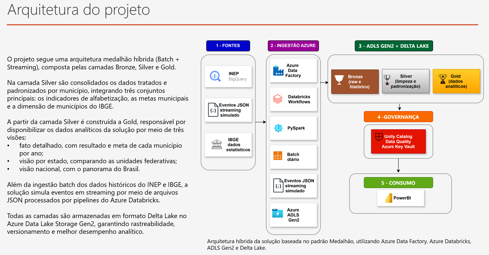

## Postech Tech Challenge | Fase 2: 

**Integrantes do Grupo (2IAST 23):**

✅ Célia Maria Tomitsuka - RM374490

✅ Nelson da Silva Paz - RM374983

✅ Nelson Toshikazu Yamamoto - RM374494

---

### 1-  Contexto

A alfabetização infantil é um dos principais indicadores de desenvolvimento educacional do país. O programa Compromisso Nacional Criança Alfabetizada estabelece metas para que todas as crianças brasileiras estejam alfabetizadas até o final do 2º ano do Ensino Fundamental até 2030.

Este projeto integra dados do INEP, IBGE e metas educacionais para monitorar a evolução dos indicadores de alfabetização nos municípios brasileiros, fornecendo uma base confiável para análises, tomada de decisão e formulação de políticas públicas.

---

### 2 - Arquitetura



---

### 3 - Tecnologias Utilizadas

| Tecnologia | Finalidade |
|------------|------------|
| Azure Data Factory | Orquestração dos pipelines de ingestão |
| Azure Data Lake Storage Gen2 | Armazenamento das camadas Bronze, Silver e Gold |
| Azure Databricks | Processamento distribuído dos dados |
| Delta Lake | Armazenamento transacional e otimização analítica |
| Azure Event Hub | Simulação de ingestão streaming |
| Azure Key Vault | Gerenciamento

---

### 4 - Decisões Arquiteturais

#### Batch x Streaming

A ingestão batch foi utilizada para dados históricos do INEP e IBGE, enquanto o streaming foi adotado para simular atualizações contínuas de indicadores educacionais.

#### Data Lake x Data Warehouse

A escolha do Data Lake permitiu armazenar dados brutos e processados com maior flexibilidade e menor custo operacional.

### Custo x Performance

A utilização de Delta Lake, particionamento e ZORDER permitiu equilibrar desempenho analítico e consumo de recursos computacionais.

---

### 5 - Aplicações em Inteligência Artificial

A camada Gold foi estruturada para servir como base para futuras aplicações de IA e Ciência de Dados, tais como:

- Predição da taxa de alfabetização por município.
- Identificação de municípios com maior risco de não atingir metas.
- Clusterização de municípios por perfil educacional.
- Modelagem de desigualdades regionais.
- Forecast da evolução dos indicadores até 2030.
- Apoio à formulação de políticas públicas baseadas em dados.

---

### 6 - Como Executar

---
3.1 - Clonar repositório

git clone https://github.com/FIAPCientistasDados/postech-aisc-fase-2-pipeline-azure-g23

---

3.2 - Acessar a pasta do projeto e instalar as bibliotecas

cd postech-aisc-fase-2-pipeline-azure-g23

python -m venv venv

venv\Scripts\activate

pip install -r requirements.txt

---

3.3 - Configure o .env com suas credenciais Azure (use .env.Example como base) e rode a pipeline com **make deploy**

---

## Alfabetização Brasil — Pipeline de Dados
### 7 - Camada Bronze

A camada **Bronze** foi responsável pela ingestão e armazenamento dos dados brutos provenientes das fontes externas, preservando sua estrutura original para garantir rastreabilidade e reprocessamento quando necessário.

Nesta etapa foram carregadas três fontes principais de dados:

| Notebook | Descrição |
|-----------|------------|
| `bronze_inep_alfabetizacao.ipynb` | Realiza a extração dos dados de alfabetização disponibilizados pelo INEP através do Google BigQuery. A autenticação é realizada utilizando credenciais de serviço do Google Cloud, permitindo a consulta e exportação dos dados para o Data Lake na camada Bronze. |
| `bronze_ibge_estados.ipynb` | Responsável pela ingestão dos dados cadastrais dos estados brasileiros disponibilizados pelo IBGE, utilizados como referência geográfica para integração e enriquecimento dos dados analíticos. |
| `bronze_ibge_municipios.ipynb` | Responsável pela ingestão dos dados cadastrais dos municípios brasileiros disponibilizados pelo IBGE, compondo a base de referência territorial da solução. |
| `streaming/producer.ipynb` | Simula a geração de eventos em tempo real no formato JSON, representando atualizações de indicadores educacionais. Os eventos são utilizados para demonstrar o processamento contínuo de dados em uma arquitetura híbrida (Batch + Streaming). |
| `streaming/config.ipynb` | Centraliza as configurações compartilhadas do pipeline de streaming, incluindo parâmetros de conexão, armazenamento e execução. |
| `streaming/functions.ipynb` | Contém funções utilitárias utilizadas pelos componentes de streaming para leitura, transformação e gravação dos eventos processados. |

Para a base de alfabetização do **INEP**, os dados foram obtidos diretamente do **Google BigQuery**, utilizando uma **Service Account** do Google Cloud para autenticação. Após a conexão com o BigQuery, os conjuntos de dados foram extraídos e armazenados no Data Lake sem transformações, mantendo a integridade dos dados originais para as etapas subsequentes de tratamento e enriquecimento nas camadas **Silver** e **Gold**.

Os dados do **IBGE** foram ingeridos como tabelas de referência geográfica, servindo de base para a normalização e enriquecimento das informações de estados e municípios ao longo do pipeline analítico.

Além da ingestão batch dos dados históricos do INEP e IBGE, a solução simula eventos em streaming por meio de arquivos JSON processados por pipelines do Azure Databricks.

---

### 8 - Validar conexão (camada Gold)
python src/ingestion/test_connection.py

#### Alfabetização Brasil — Pipeline de Dados (Camada Gold)
#### Pipeline de dados em **Databricks + Delta Lake** que consolida indicadores de alfabetização municipal, estadual e nacional, com **qualidade de dados (DQ)**, **rastreabilidade** e **auditoria** em cada etapa.
> Objetivo de negócio: monitorar o cumprimento das metas de alfabetização dos municípios brasileiros entre **2023 e 2024**, identificando onde o Brasil avançou e onde ainda está aquém.
---
#### Arquitetura```mermaidflowchart LR    subgraph SILVER["Camada Silver (Delta)"]        S1["silver.indicador_municipio"]        S2["silver.meta_municipio"]        S3["silver.dim_ibge_municipios"]    end
    subgraph GOLD["Camada Gold (Delta)"]        F["gold.fato_alfabetizacao_municipio"]        V1["gold.visao_uf"]        V2["gold.visao_brasil"]        V3["gold.consolidacao_validacao"]    end
    S1 --> F    S2 --> F    S3 --> F    F --> V1    F --> V2    V1 --> V3    V2 --> V3```
#### **Camada Silver (entrada):** dados já tratados e padronizados por município.**Camada Gold (saída):** dados consolidados, particionados e otimizados para consumo analítico.
---
#### Fluxo de Processamento```mermaidflowchart TD    A["Leitura das tabelas Silver"] --> B["Transformações e cálculo de indicadores"]    B --> C["Data Quality: nulos e duplicados na chave"]    C --> D{"Chave íntegra?"}    D -->|"Sim"| E["Gravação via CTAS em Delta"]    D -->|"Não"| H["Registro de falha em monitoring.dq_results"]    E --> F["OPTIMIZE + ZORDER BY"]    F --> G["Validação final e leitura"]    H --> B```
Cada notebook segue o padrão: **leitura → agregação → DQ → CTAS → ZORDER → validação**.
---
#### Tabelas Geradas

| Tabela | Granularidade | Registros | Papel ||--------|---------------|-----------|-------|| `gold.fato_alfabetizacao_municipio` | `(ano, id_municipio, rede)` | 10.704 | Base detalhada: resultado × meta por município || `gold.visao_uf` | `(ano, estado_sigla, rede)` | 50 | Comparativo entre estados || `gold.visao_brasil` | `(ano, rede)` | 2 | Painel executivo nacional (2023 e 2024) |

#### Estrutura dos Notebooks

| Notebook | Saída | Tipo ||----------|-------|------|| `01_gold_fato_alfabetizacao_municipio` | `gold.fato_alfabetizacao_municipio` | Gravação (CTAS) || `02_gold_visao_uf` | `gold.visao_uf` | Gravação (CTAS) || `03_gold_visao_brasil` | `gold.visao_brasil` | Gravação (CTAS) || `04_gold_consolidacao_validacao` | — | Somente leitura / validação |
---
#### Dicionário de Dados
#### `gold.fato_alfabetizacao_municipio`

| Coluna | Descrição ||--------|-----------|| `ano` | Ano de referência (2023, 2024) || `id_municipio` | Código IBGE do município || `estado_sigla` | UF (AC, AL, AM, ...) || `rede` | Código da rede de ensino || `rede_nome` | Nome da rede (ex.: Municipal) || `resultado` | Taxa de alfabetização observada || `meta` | Meta de alfabetização definida (NULL em 2023) || `folga_pp` | Diferença em pontos percentuais (resultado − meta) || `status_meta` | `ATINGIU`, `NAO_ATINGIU` ou `SEM_META` || `ingested_at`, `source`, `version` | Rastreabilidade |
#### `gold.visao_uf` e `gold.visao_brasil`

| Coluna | Descrição ||--------|-----------|| `total_municipios` | Total de registros no grupo || `municipios_distintos` | Municípios únicos (apenas visão Brasil) || `taxa_media` | Média da taxa de alfabetização || `meta_media` | Média das metas || `pct_atingiram_meta` | % de municípios que atingiram a meta || `municipios_atingiram` / `municipios_sem_meta` | Contagens absolutas |
#### Relacionamento entre tabelas```mermaiderDiagram    FATO ||--o{ VISAO_UF : "agrega por (ano, UF, rede)"    FATO ||--o{ VISAO_BRASIL : "agrega por (ano, rede)"    FATO {        int ano        int id_municipio        string estado_sigla        string rede_nome        double resultado        double meta        string status_meta    }    VISAO_UF {        int ano        string estado_sigla        string rede_nome        double taxa_media        double meta_media        double pct_atingiram_meta    }    VISAO_BRASIL {        int ano        string rede_nome        int total_municipios        double taxa_media        double pct_atingiram_meta    }```
---
#### Qualidade de Dados

Todas as chaves foram validadas sem nulos e sem duplicados. Cada execução registra o resultado em `monitoring.dq_results` para auditoria.
| Tabela | Chave composta | Nulos | Duplicados ||--------|----------------|-------|------------|| Fato | `(ano, id_municipio, rede)` | 0 | 0 || Visão UF | `(ano, estado_sigla, rede)` | 0 | 0 || Visão Brasil | `(ano, rede)` | 0 | 0 |```mermaidflowchart LR    subgraph DQ["monitoring.dq_results"]        R1["completude_chave"]        R2["unicidade_chave_composta"]    end    FATO --> R1    FATO --> R2    VISAO_UF --> R1    VISAO_UF --> R2    VISAO_BRASIL --> R1    VISAO_BRASIL --> R2```
---
#### O que os números contam (análise)
#### Brasil: evolução 2023 → 2024

- Taxa média nacional subiu de **60.48** para **63.04** (+2,56 p.p.).- Em 2024, **5.232 municípios** tinham meta definida e **2.788 atingiram** — **52,09%** de cumprimento.- Isso significa que **47,9% dos municípios ficaram abaixo da meta** em 2024.```mermaidpie showData    title Atingimento de meta — Brasil 2024    "Atingiram a meta (52.09%)" : 52.09    "Abaixo da meta (47.91%)" : 47.91```

#### Disparidade regional

- Destaques positivos: **CE (91,3%)** e **GO (80,0%)** de atingimento.- A variação entre estados mostra que o desafio é **regional e local**, não nacional — sinalizando onde priorizar política pública.
#### 2023 como linha de base

- Sem meta definida naquele ano, serve como referência histórica para medir a evolução a partir de 2024.
---
#### Padrões Técnicos

- **Formato:** Delta Lake, `PARTITIONED BY (ano)` + `OPTIMIZE ... ZORDER BY`.- **Gravação:** CTAS (`CREATE OR REPLACE TABLE ... AS SELECT`) — compatível com serverless.- **Rastreabilidade:** colunas `ingested_at`, `source`, `version` em todas as tabelas.- **DQ:** `monitoring.dq_results` registra regra, status, registros verificados e falhas por execução.
---
#### Como Executar

1. Garanta as tabelas Silver (`indicador_municipio`, `meta_municipio`, `dim_ibge_municipios`).2. Rode os notebooks em ordem: `01` → `02` → `03`.3. Opcional: `04` para consolidar e validar o conjunto final.
---
#### Próximos Passos Sugeridos

- Investigar os municípios abaixo da meta em 2024 (ranking por UF e município).- Acompanhar a evolução 2024 → 2025 para medir o ritmo de avanço.- Cruzar com variáveis socioeconômicas (IDH, renda) para entender os fatores do não cumprimento.- Evoluir para uma camada de visualização (Power BI / Databricks SQL Dashboard).

--- 

### 9 - Monitoramento e Otimização de Custos (FinOps)

A solução foi projetada para garantir eficiência operacional, observabilidade e otimização do consumo de recursos em nuvem, seguindo boas práticas de FinOps e Governança de Dados.

#### Otimização de Custos (FinOps)

As seguintes estratégias foram adotadas para reduzir custos de armazenamento e processamento:

- Utilização do formato Delta Lake, que proporciona melhor desempenho de leitura e gravação em comparação a formatos tradicionais.

- Particionamento por ano, reduzindo o volume de dados lidos em consultas analíticas.

- Uso de OPTIMIZE e ZORDER BY, melhorando a performance das consultas por meio da organização física dos dados.

- Processamento sob demanda no Azure Databricks, evitando consumo desnecessário de recursos computacionais.

- Separação das camadas Bronze, Silver e Gold, permitindo reutilização dos dados já processados e reduzindo reprocessamentos.

- Provisionamento automatizado da infraestrutura utilizando Azure Bicep, garantindo padronização e evitando desperdício de recursos.

---

### 10 - Monitoramento e Observabilidade

Para garantir a confiabilidade da solução, foram implementados mecanismos de monitoramento e controle da qualidade dos dados:

- Registro das execuções e resultados das validações de qualidade em tabelas de auditoria.

- Verificação automática de integridade, completude e unicidade das chaves de negócio.

- Interrupção controlada do pipeline em caso de falhas críticas de qualidade de dados.

- Rastreabilidade completa por meio das colunas de auditoria (ingested_at, source e version).

- Integração com recursos de monitoramento da plataforma Azure para acompanhamento das execuções e identificação de falhas operacionais.

- Governança centralizada utilizando Unity Catalog e gerenciamento seguro de credenciais por meio do Azure Key Vault.

---

### 11 - Estrutura das pastas do repositório

| Caminho | Descrição |
|----------|------------|
| `credenciais/` | Arquivos de autenticação utilizados para acesso aos serviços externos. |
| `credenciais/tough-medley-xxxxx.json` | Chave de serviço para autenticação do Google BigQuery. |
| `datalake/` | Estrutura do Data Lake organizada nas camadas Silver e Gold. |
| `datalake/silver/` | Camada de refinamento e enriquecimento dos dados. |
| `datalake/silver/01_silver_indicador_municipio.ipynb` | Processamento dos indicadores por município. |
| `datalake/silver/02_silver_indicador_uf.ipynb` | Processamento dos indicadores por UF. |
| `datalake/silver/03_silver_meta_brasil.ipynb` | Consolidação das metas em nível nacional. |
| `datalake/silver/04_silver_meta_uf.ipynb` | Consolidação das metas por UF. |
| `datalake/silver/05_silver_meta_municipio.ipynb` | Consolidação das metas por município. |
| `datalake/silver/06_silver_alunos.ipynb` | Tratamento e preparação dos dados de alunos. |
| `datalake/silver/07_silver_dim_ibge_estados.ipynb` | Criação da dimensão de estados baseada no IBGE. |
| `datalake/silver/08_silver_dim_ibge_municipios.ipynb` | Criação da dimensão de municípios baseada no IBGE. |
| `datalake/gold/` | Camada analítica para consumo dos dados. |
| `datalake/gold/01_gold_fato_alfabetizacao_municipio.ipynb` | Construção da tabela fato de alfabetização por município. |
| `datalake/gold/02_gold_visao_uf.ipynb` | Geração da visão analítica por UF. |
| `datalake/gold/03_gold_visao_brasil.ipynb` | Geração da visão consolidada do Brasil. |
| `datalake/gold/04_gold_consolidacao_validacao.ipynb` | Consolidação e validação final dos dados. |
| `dbfs/` | Armazenamento de arquivos do Databricks File System (DBFS). |
| `tmp/` | Diretório para arquivos temporários. |
| `tmp/temp.parquet` | Arquivo temporário em formato Parquet. |
| `.gitkeep` | Arquivo utilizado para manter diretórios vazios versionados no Git. |
| `docs/` | Documentação do projeto. |
| `docs/imagens` | Pasta de imagens do projeto. |
| `docs/imagens/Arquitetura_do_projeto.png` | Imagens da arquitura do projeto. |
| `docs/[IAST] - Tech Challenge - Fase 2.pdf` | Documento de especificação do desafio técnico. |
| `docs/Dicionario_dados_alfabetizacao_fase_2.md` | Dicionário de dados da solução. |
| `docs/Tech Challenge – Fase 2 (executivo).pptx` | Apresentação executiva do projeto. |
| `infra/` | Infraestrutura como Código (IaC) utilizando Azure Bicep. |
| `infra/modules/` | Módulos reutilizáveis para provisionamento dos recursos da arquitetura. |
| `infra/modules/adf.bicep` | Provisiona o Azure Data Factory. |
| `infra/modules/bigqueryToBlob.bicep` | Configura integração entre BigQuery e Azure Blob Storage. |
| `infra/modules/databricks.bicep` | Provisiona o Azure Databricks. |
| `infra/modules/datafactory.bicep` | Configurações complementares do Azure Data Factory. |
| `infra/modules/eventhub.bicep` | Provisiona o Azure Event Hub. |
| `infra/modules/keyvault.bicep` | Provisiona o Azure Key Vault para gerenciamento de segredos. |
| `infra/modules/loganalytics.bicep` | Provisiona o Log Analytics Workspace. |
| `infra/modules/monitoring.bicep` | Configura monitoramento e observabilidade da solução. |
| `infra/modules/storage.bicep` | Provisiona contas e recursos de armazenamento. |
| `infra/parameters/` | Arquivos de parâmetros para implantação dos recursos. |
| `infra/parameters/prod.bicepparam` | Parâmetros de implantação para ambiente produtivo. |
| `infra/databricksPipeline.bicep` | Definição da infraestrutura do pipeline Databricks. |
| `infra/main.bicep` | Arquivo principal de orquestração da infraestrutura. |
| `infra/main.json` | Template ARM gerado a partir dos arquivos Bicep. |
| `jobs/` | Notebooks de ingestão e processamento de dados. |
| `jobs/bronze_ibge_estados.ipynb` | Ingestão dos dados de estados na camada Bronze. |
| `jobs/bronze_ibge_municipios.ipynb` | Ingestão dos dados de municípios na camada Bronze. |
| `jobs/bronze_inep_alfabetizacao.ipynb` | Ingestão dos dados de alfabetização do INEP na camada Bronze. |
| `jobs/streaming/` | Componentes do pipeline de streaming de dados. |
| `jobs/streaming/config.ipynb` | Configurações compartilhadas do pipeline de streaming. |
| `jobs/streaming/functions.ipynb` | Funções utilitárias utilizadas pelos notebooks de streaming. |
| `jobs/streaming/listar_container.ipynb` | Utilitário para listagem de containers e arquivos. |
| `jobs/streaming/producer.ipynb` | Simulador/produtor de eventos para ingestão em tempo real. |
| `jobs/tmp/` | Área temporária utilizada durante a execução dos jobs. |

---

### 12 - Dicionário de dados

Localizada na pasta: docs/Dicionario_dados_alfabetizacao_fase_2.md

---

### 13 - PowerPoint da Apresentação

Localizada na pasta: docs/Tech Challenge – Fase 2(executivo).pptx

---

### 14 - Vídeo executivo (até 5 minutos)

Link do vídeo executivo (5 min): https://www.loom.com/share/318459135a80483b8daa9a74f95ff186

---

### 15 - Conclusão

A solução implementa uma arquitetura moderna de dados em Azure baseada no padrão Medalhão, integrando dados educacionais e territoriais por meio de pipelines Batch e Streaming.

O projeto entrega uma base analítica confiável para acompanhamento das metas de alfabetização no Brasil, incorporando práticas de governança, qualidade de dados, monitoramento e otimização de custos.

---
